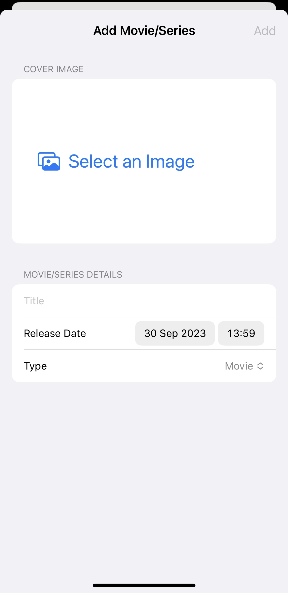
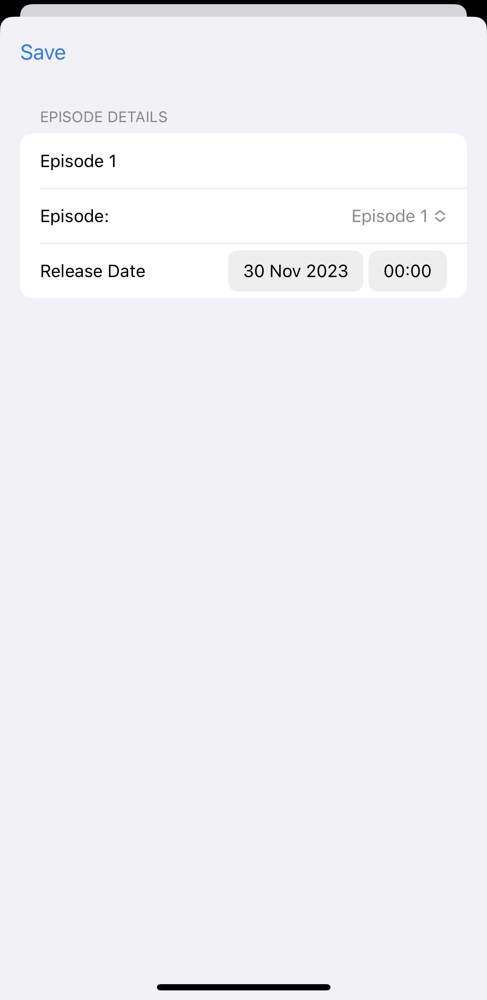
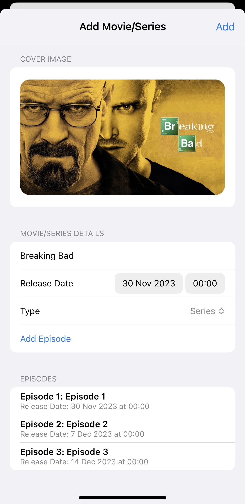
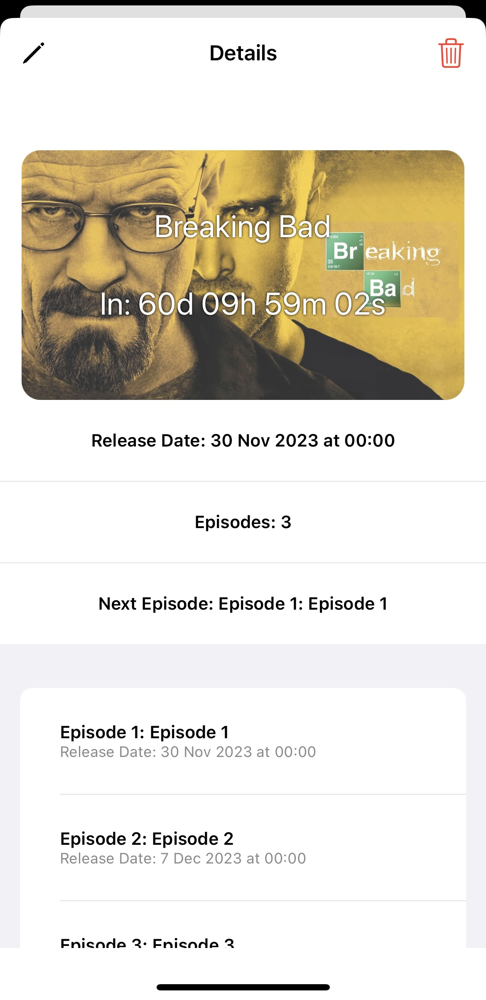

# WatchList
Application to manage upcoming releases and track currently watched movies or series

<ul>
<li>Created for fun!</li>
<li>Might update someday</li>
</ul>

## How it looks like

### Add new Movie or TV Series

    
    

### Fill it up

    
    

What you can add:  
<ul>
<li>Cover Image</li>
<li>Title</li>
<li>Release Date</li>
<li>Type
<ul>
<li>Movie</li>
<li>Series
<ul>
<li>Episodes*</li>
</ul>
</li>
</ul>
</li>
</ul>  

*Episodes will have their release date adjusted based on the release date of a TV Series and number of episode

### Main Screen

Your added show on the main screen

    

### Details

After selecting your show from the main screen you'll be presented with more details

    

## Requirements

<ul>
<li>Cocoapods</li>
</ul>

## Used

* [Mantis](https://github.com/guoyingtao/Mantis/tree/master) to crop an image
